# Introduction
Online News articles are one of the channels that media companies connect with their users through Internet. Every day many news articles are produced and read. News articles are online texts that contain up-to-date information in many contexts. We have inspired from the website http://eventregistry.org/.

# Datasets
## News Dataset
We needed There is no real time data available for our purpose. However, we acquired the data scraping the news websites.

In short, we run our algorithms on ~180.000 news articles crawled by second crawler described below:

### Breadth First Crawler

Our initial plan was to continuosly crawl the following Turkish news websites:
1. Cumhuriyet: www.cumhuriyet.com.tr
2. NTV: www.ntv.com.tr
3. Hurriyet: www.hurriyet.com.tr
4. Milliyet: www.milliyet.com.tr
5. Posta: www.posta.com.tr
6. Sabah: www.sabah.com.tr
7. Star: www.star.com.tr
8. Takvim: www.takvim.com.tr

We used started crawling milliyet.com.tr and takvim.com.tr.
Our algorithm consist of two simple steps:
1. Store data if there are any significant (news story, news title, news description) content in the page via news-please library.
2. Visit all URLs in breadth first order targeted to source domain apply step 1 & 2 again.

We implemented the crawler and ran for 4 days and crawled 259.978 news articles.

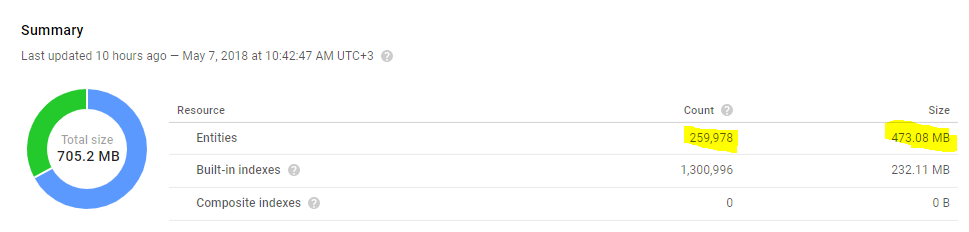

Title, description, publish date, article link are extracted for each news article.

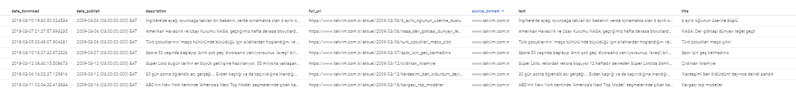

Crawled data are stored in Google Cloud Datastore which is NoSQL Document Database.
Datastore ease our job to access our data while using other Google Cloud services to run our algorithms in.

We want to filter already-visited URLs to speed up our data-crawling speed.
However, when we try to hash 200.000 URLs(which is not a distant) to a regular hashmap, it takes 19 GB memory. This implementation uses so much memory due to Step 2 in the algorithm above.

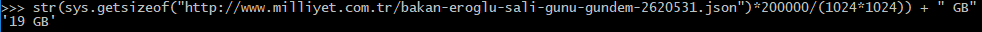

This image demonstrates that how much space 200.000 url strings take in Python3.

We needed our crawler to work continuosly without crashing.
However, to run our crawler on the Google Cloud Compute Instance, we needed expensive Compute instances with high memory to run our crawler.
When that was the case, we were to run out of free credits provided by Google Cloud in only 4 days:

To solve that problem, we implemented the Bloom Filters described in Bloom Filters section.
However, we also implemented the crawler in a new way, as described in the following section:

### Latest News Crawler

Since we realized the requirement for memory-efficient implementation for crawler and latest news would be better for us to make some inferences on data, we implemented this crawler.

RSS is a standard for distribution of contents such as news to online users. News websites distributes their latest news(only title, url, and description) through their RSS's.

The procedure for our latest news crawler is the following:

1. Visit RSS of 64 news websites.
2. Extract title, description, and URLs from RSS entities.
3. Visit URL of each entity and extract content via news-please library.
4. Store the all crawled information (title, description, content, url) for each news article into Google Datastore.  (if URL is not visited before)
5. Repeat these steps every 15 minutes.

The news websites we are crawling are:
1. Anadolu Ajansı: https://aa.com.tr/tr/rss/default?cat=guncel
2. Cumhuriyet: http://www.cumhuriyet.com.tr/rss/son_dakika.xml
3. Anayurt Gazetesi: http://www.anayurtgazetesi.com/sondakika.xml
4. Dünya Gazetesi: https://www.dunya.com/rss?dunya
5. Balkan Günlüğü: https://www.balkangunlugu.com/feed/
6. Gerçek Gündem: http://www.gercekgundem.com/rss
7. Haberturk: http://www.haberturk.com/rss
8. Hurriyet: http://mix.chimpfeedr.com/07479-Hurriyet-Gazetesi
9. Milliyet Gazetesi: http://www.milliyet.com.tr/rss/rssNew/gundemRss.xml
10. Önce Vatan Gazetesi: http://www.oncevatan.com.tr/rss.php
11. Sabah Gazetesi: http://mix.chimpfeedr.com/d1bed-Sabah-Gazetesi
12. Star: http://www.star.com.tr/rss/rss.asp
13. Takvim: https://www.takvim.com.tr/rss/anasayfa.xml
14. Türkiye Gazetesi: http://www.turkiyegazetesi.com.tr/rss/rss.xml
15. Vatan Gazetesi: http://mix.chimpfeedr.com/68482-Vatan-Gazetesi
16. Yeniçağ: http://www.yenicaggazetesi.com.tr/rss
17. Yeni Mesaj: http://www.yenimesaj.com.tr/rss.php
18. Yeni Şafak: https://www.yenisafak.com/Rss
19. Yurt Gazetesi: http://www.yurtgazetesi.com.tr/rss.php
20. Sozcu: https://www.sozcu.com.tr/feed
21. Fotomaç: https://www.fotomac.com.tr/rss/anasayfa.xml
22. A Haber: https://www.ahaber.com.tr/rss/anasayfa.xml
23. CNNTurk: https://www.cnnturk.com/feed/rss/news
24. EuroNews: http://feeds.feedburner.com/euronews/tr/home?format=xml
25. NTV: http://mix.chimpfeedr.com/6ab71-NTV
26. TRT Haber: http://www.trthaber.com/sondakika.rss
27. Ulusal Kanal Haber Portalı: http://www.ulusal.com.tr/rss.php
28. Ajans Haber: http://www.ajanshaber.com/rss
29. Amerika Bülteni: http://feeds.feedburner.com/amerikabulteni?format=xml
30. Ankara Review: http://www.ankarareview.com/feed/
31. Ay Gazete: http://www.aygazete.com/rss/gundem-haberleri
32. Bas News: http://www.basnews.com/index.php/tr/detail/content/195-basnews-tr?format=feed&type=rss
33. BBC Türkçe: http://feeds.bbci.co.uk/turkce/rss.xml
34. Bianet: http://bianet.org/bianet.rss
35. Canli Haber: https://www.canlihaber.com/rss/
36. Dipnot: http://www.dipnot.tv/feed/
37. Diken: http://www.diken.com.tr/feed/
38. DW-World: https://rss.dw.com/rdf/rss-tur-all
39. En Son Haber: http://www.ensonhaber.com/rss/ensonhaber.xml
40. Eurovizyon: http://www.eurovizyon.co.uk/rss.php
41. F5 Haber: http://www.f5haber.com/rss/haberler.xml
42. Gazete Duvar: https://www.gazeteduvar.com.tr/feed/
43. Gazete Karınca: http://gazetekarinca.com/feed/
44. Girişim Haber: http://www.girisimhaber.com/rss.xml
45. Haber vaktim: https://www.habervaktim.com/rss/
46. Haberler.com: http://rss.haberler.com/rss.asp?kategori=sondakika
47. Haber7: http://sondakika.haber7.com/sondakika.rss
48. Halkin Habercisi: http://www.halkinhabercisi.com/feed
49. İleri Haber: http://ilerihaber.org/rss.xml
50. İnadına Haber: http://inadinahaber.org/feed/
51. İnternet Haber: http://www.internethaber.com/rss
52. Kampüs Haber: http://www.kampushaber.com/rss.xml
53. Manset Haber: http://www.mansethaber.com/rss.xml
54. Senin Medyan: https://seninmedyan.org/feed/
55. National Turk: http://www.nationalturk.com/feed/
56. Objektif Haber: http://www.objektifhaber.com/sondakika.rss
57. Oda TV: https://odatv.com/rss.php
58. Pirha: https://www.pirha.net/feed/
59. Press Turk: http://www.pressturk.com/rss.xml
60. Haber Sol: http://haber.sol.org.tr/rss/tumicerik
61. Sonsöz: http://sonsoz.com.tr/feed/
62. Sputnik News Türkçe: https://tr.sputniknews.com/export/rss2/archive/index.xml
63. Türkiye Haber Ajansı: http://www.turkiyehaberajansi.com/rss.xml
64. Yakin Plan: https://yakinplan.com/feed/

Our latest news crawler is running on cheapest Google Cloud Compute f1-micro (1 vCPU, 0.6 GB memory)] and crawling since Mar 13, 2018, 8:30:00 PM and crashed only 2 times since then.
We achieved both stability and memory-efficiency through our new implementation.

Our crawler has crawled 180.870 news articles in total from Mar 13, 2018, 8:30:00 PM until now:

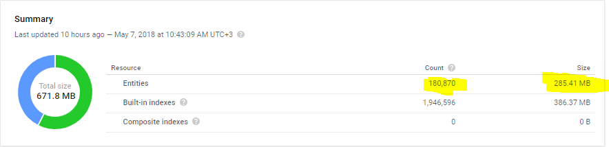

## 6000 Tweets Sentiment Classification Dataset
6000 tweets dataset consists of 3000 negative, 1552 positive and 1448 notr tweets.
Test data is chosen as 20% of the dataset which is 1200. Validation splits are chosen as 20% of training set which are 960 tweets each.

The dataset is obtained from

## 35000 Sentences Named Entity Recognition Dataset

# Algorithms

## Bloom Filtering

#### Task Definition
As we discussed in "Breadth First Crawler" section, we encountered memory problems while crawling websites. The purpose of bloom filtering is to lookup for visited websites for our crawlers and not to visit websites that are visited before.
The bloom filters are to check a membership in a set for an element.

#### Algorithm Definition
The section below is taken from https://github.com/selimfirat/bloom-filtering [1] which is implemented and written by Selim Fırat Yılmaz(one of our group members).

In data streaming, we may need to apply some filtering process to accept some elements that meet a criterion.
Rejected elements are dropped whereas accepted elements are proceeded to the stream.

For the case of Bloom Filtering, the criterion is to lookup for a membership of a set.
Bloom filters eliminate most of the elements that are not in the set and rejected elements are certainly not in the set.
In other words, the false negative is always 0 whereas bloom filters can only say the element is "maybe" in the set.

Procedure of the bloom filtering is the following:

1. Init the array of bits a, initially all 0.
2. Set 2 hash functions h1(x), h2(x).
3. ones(x) gives the the # of bits in the binary representation of x.
4. zeros(x) gives the the # of bits in the binary representation of x
5. For element el to be added to the set,
    - a[h1(zeros(el))] = 1
    - a[h2(ones(el)) = 1
6. To check whether an element might be in the set,
    - a[h1(zeros(el))] == 1 and a[h2(ones(el)) == 1
7. To check whether an element is not in the set,
    - not (a[h1(zeros(el))] == 1 and a[h2(ones(el)) == 1)

More general version of the bloom filtering can be found on the book[2] below in references section.

#### Experimentation Methodology
We applied the described algorithm for bit array with length 2^16, when distinct random samples are introduced and tested to the bloom filter.

#### Experimentation Results
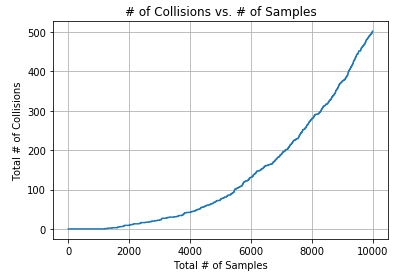

Number of collisions here indicates the false positive rate which is 0.05 in this analysis.

#### Discussion
Thus, we can say that we have not visited a certain url before with probability of 0.95 if an url is not hashed to same locations before.
If an URL is not marked as visited, we can say that we already visited that url with 0.05 probability.
These are good rates for us to use this algorithm for our task which is not to re-visit any visited url.

## Clustering News

## Sentiment Classification

#### Task Definition
As people express their opinions via their writings or tweets, news Sources express their support/criticism via their articles. Although journals have to be objective, many of news sources are biased and do not follow this rule.
Our target is to classify supportive articles as positive criticizing articles as negative and others as notr. Simply, we want to map a news article to the labels POSITIVE, NEGATIVE, and NOTR.

Turkish is a morphologically rich and an agglutinative language. In such languages data sparsity is a huge problem. This problem will be detailed Word2Vec subsection below. Also, lack of enough data and lack of available NLP tools for Turkish makes this task harder.

#### Logistic Regression Algorithm

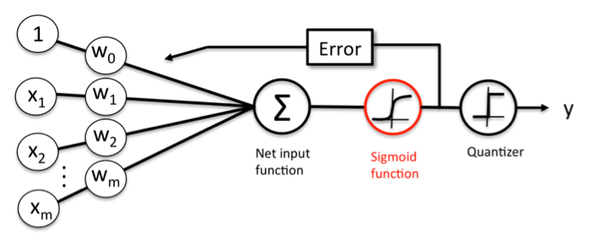
In logistic regression

Since logistic regression function is continuous, it can easily be optimized via calculating and moving towards its gradient.

#### Running via Apache Beam Mapreduce
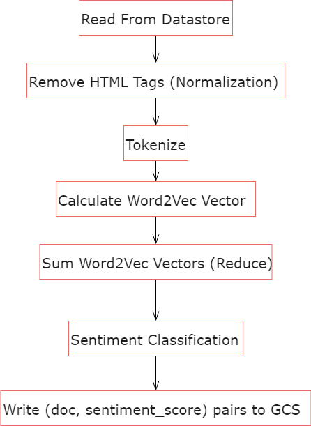

Note: Apache beam redirects some steps to the disks only when it is required. Thus, there is not much difference between map step and yielding foreach loop in redundant mappings. Reactive programming style is used to improve the quality and understandibility of the implementation.

##### Pre-processing
###### Normalization
The labeled data for sentiment analysis are tweets which are very dissimilar in many ways. For example, tweets are very short in terms of text length compared to news articles.
Tweets are much more informal than news articles mostly written by individuals, not journalists. Converting an informal text to a formal one with proper language usage is called normalization. Also, many tweets are not written with proper turkish characters since most people use English layout keyboard on their mobile phones.

The normalization example for the tweet "@dida what’s up, why don’t you call #offended :(" is below:

 [8]

To normalize turkish tweets in our 6000 tweets dataset, we use Turkish Tweet Normalizer library [11].

As we see no improvement on validation step when tweets are normalized, we wondered whether our text normalizer.
To research this issue, we compared with popular Turkish NLP tools for normalization which are Zemberek3 [9] and ITU Normalization Service [10] as following:

 [8]

These results do not indicate any problem with the library we use(Turkish Text Normalizer (With NLTK)).

###### Sentence Tokenization
Sentence tokenization is simply the separating different sentences in a text from each other. In medium-sized writings such as news articles, sentences are usually seperated with dots. However, there are many abbreviations that use dot (.) to indicate abbreviation in Turkish language.

Thus, we use pre-trained Punkt sentence tokenizer model [13] for Turkish language and trained it more largest Turkish abbreviations corpus used by Zemberek3 [9].

###### Word Tokenization
Word tokenization is simply the separating different words/punctuations etc. in a text from each other. Word tokenization is rather simple. Splitting via spaces are enough. Also, punctuations, negating suffix(-me, -ma) are considered as separate tokens in our implementations. NLTK library [12] handles such cases.

###### Stemming
Stemming is to obtain the surface form of the words. Since turkish is an agglutinative language, this process would reduce the vocabulary size and may result in better results.

To stem a word, Turkish Stemmer library [15] is used.

##### Features
###### Bag-of-Words
Bag-of-words is a matrix containing the number of occurrences of a token in text.

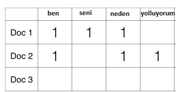

Tokens may be words as well as n word shingles. n-shingles are the consecutively occurred n words in text.

Tokens may also be stemmed or normalized as stated in any experimentation detail.

###### TF-IDF
TF-IDF is an information retrieval technique that measures the relative importance of tokens. The metrics used are term frequency(tf) and inverse document frequency(idf).

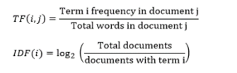

TF-IDFs are useful on retrieving the tokens that determine the context of a particular text as well as eliminating stop words.

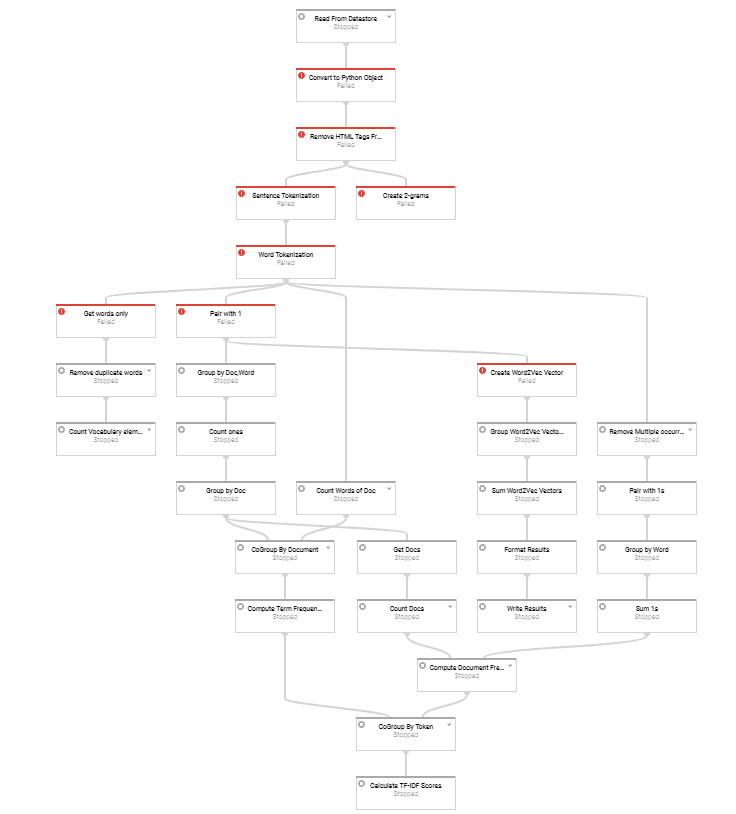

Here, we tried to run via dataflow but some steps seems failed since the error caused by word2vec related stuff. In fact, later we switched to Google Cloud Compute Instance to run Mapreduce implementation of TF-IDF.Note: Apache beam redirects some steps to the disks only when it is required. Thus, there is not much difference between map step and yielding foreach loop in redundant mappings. Reactive programming style is used to improve the quality and understandibility of the implementation.

###### Word2vec
As we discussed in the task definition of sentiment classification, morphological richness property of Turkish language causes data sparsity problem.
The matrices we obtained for bag of words and tf-idf are very sparse. For example, 6000 tweets sentiment classification dataset has 26000 words in total. This is a large number to compute and also very low number for a model to be able to classify.
It is not possible to classify out-of-vocabulary words using bag-of-words and tf-idf features. We can decrease the out-of-vocabulary words in any text via stemming and normalization.
However, a real solution to this problem is using pre-trained Word2Vec models as nearly all researchers do.

Thus, we prefered to switch Word2Vec model [14] pretrained on 800k words wikipedia data.
This provides us much larger corpus containing 800000.

#### Experimentation Methodology
To make experiments on, 6000 tweets dataset is used. We first made experiments using sklearn [6] library in order to be sure about the implementations we tested are correct and easily validate them. Later, we implement the best fitting model in matrix library numpy [7] and try to get same results with this.Decision tree, logistic regression, nearest neighbor, SVM classifiers are evaluated on this dataset using SKLearn library.

High precision means most of the items classified as a label, this label is most probably the correct one.

High recall means most of the items that needed to be labelled are labelled correctly.

To compare our results with state-of-art results, we needed to use F1 scores as is in these research papers.

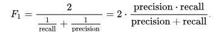

In our classifications, for each class, the true positive, true negative, false positive, false negative results are calculated and F1 score is computed. Then, F1 scores of all classes is averaged.

#### Experimentation Results

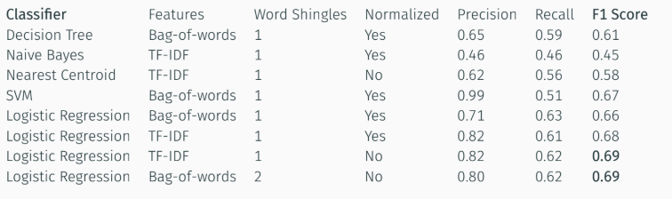

We get most accurate results with SVM and logistic regression. However, SVM is too slow to be work on larger data such as our news dataset.

Thus, we chose to implement Logistic Regression using numpy matrix computation library [7].
Below is the logistic regression experimentation results

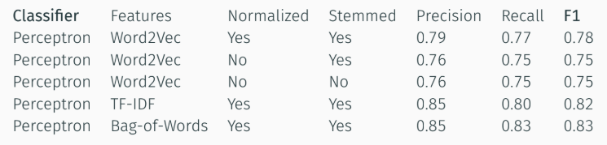

#### Related Work

#### Future Work
There is definitely lack of labeled data on news articles for sentiment analysis. Labeling new datasets for Turkish news context would be the best contribution to the field.
This process would also help for generalization of the sentiment classification task in news domain.Eliminating objective sentences would indicate the objectivity of news sources. Namely, objectivity-subjectivity of a news source can be determined.

## Named Entity Recognition

#### Related Work

#### Future Work

# Technologies & Environment

* Language: Python 3.5.4 & Python 2.7 (For Apache Beam & Google Cloud Dataflow)
* Environment: Anaconda 4.4.7
* Jupyter Notebook [18]
* Google Cloud Datastore
* Google Cloud Compute
* Google Cloud Dataflow
* Apache Beam [3]
* news-please [4]
* numpy [7]
* sklearn [16]
* keras [17]

# Related Work
Kaya et. al. [5] states that as a future work, determining which columnists write about which party/person and determine their sentiment(supportive or criticisive behavior). This is what we did in this project.

# Future Work

# Conclusion

# Bibliography
[1] https://github.com/selimfirat/bloom-filtering

[2] Leskovec, J., Rajaraman, A. and Ullman, J. (2016). Mining of massive datasets. Delhi: Cambridge University Press, pp.140-141.

[3] https://github.com/fhamborg/news-please

[4] Beam, A. An advanced unified programming model. 2016-12-02]. https://beam.apache.org.

[5] Kaya, M., Fidan, G., & Toroslu, I. H. (2012, December). Sentiment analysis of turkish political news. In Proceedings of the The 2012 IEEE/WIC/ACM International Joint Conferences on Web Intelligence and Intelligent Agent Technology-Volume 01 (pp. 174-180). IEEE Computer Society.

[6] Cournapeau, D. (2015). Sci-kit Learn. Machine Learning in Python. online,[cit. 8.5. 2017]. URL http://scikit-learn. org.

[7] Walt, S. V. D., Colbert, S. C., & Varoquaux, G. (2011). The NumPy array: a structure for efficient numerical computation. Computing in Science & Engineering, 13(2), 22-30.

[8] Torunoğlu, D., & Eryiğit, G. (2014). A cascaded approach for social media text normalization of Turkish. In Proceedings of the 5th Workshop on Language Analysis for Social Media (LASM) (pp. 62-70).

[9] Akın, A. A., & Akın, M. D. (2007). Zemberek, an open source nlp framework for turkic languages. Structure, 10, 1-5.

[10] Eryiğit, G. (2014). ITU Turkish NLP web service. In Proceedings of the Demonstrations at the 14th Conference of the European Chapter of the Association for Computational Linguistics (pp. 1-4).

[11] https://github.com/uozcan12/Twitter-Data-Normalization

[12] Bird, S., & Loper, E. (2004, July). NLTK: the natural language toolkit. In Proceedings of the ACL 2004 on Interactive poster and demonstration sessions (p. 31). Association for Computational Linguistics.

[13] https://www.kaggle.com/nltkdata/punkt

[14] https://github.com/akoksal/Turkish-Word2Vec

[15] https://github.com/otuncelli/turkish-stemmer-python

[16] Pedregosa, F., Varoquaux, G., Gramfort, A., Michel, V., Thirion, B., Grisel, O., ... & Vanderplas, J. (2011). Scikit-learn: Machine learning in Python. Journal of machine learning research, 12(Oct), 2825-2830.

[17] Chollet, F. (2015). Keras.

[18] Kluyver, T., Ragan-Kelley, B., Pérez, F., Granger, B. E., Bussonnier, M., Frederic, J., ... & Ivanov, P. (2016, May). Jupyter Notebooks-a publishing format for reproducible computational workflows. In ELPUB (pp. 87-90).